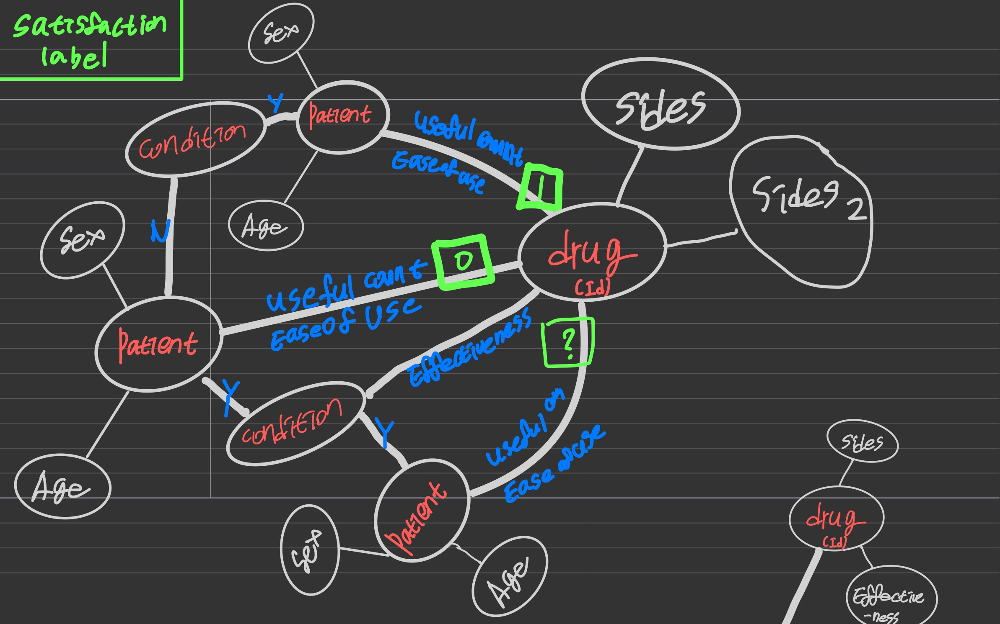
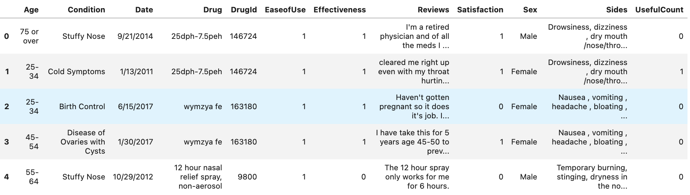

### Kaggle drug recommandation Using R-GCN (Relational GCN)



- Green : target label
- Red : Node
- Blue : Edge
- white : connection and Features of Nodes

----

- 위 그림과 같이 drug, Patient, condition 의 Features 와 노드 간의 관계를 이용해 만족도 학습
- R-GCN 모델을 이용해 학습하여, 만족도 기반으로하는 추천 모델 학습

- dataset link : `https://www.kaggle.com/datasets/rohanharode07/webmd-drug-reviews-dataset`


### Preprocessing
- `null` value 제거
- `edge relation` 정의

```
ration : 0 ~ 5
    0~3 : 0  # 관련 없음 또는 불만족
    4~5 : 1  # 관련 있음 또는 만족
```


`df_.head()`

