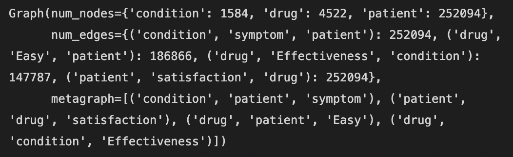
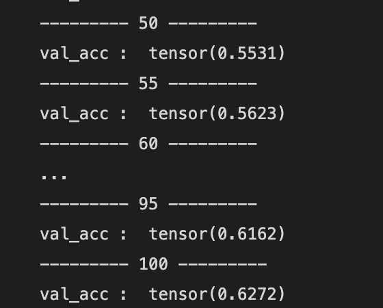
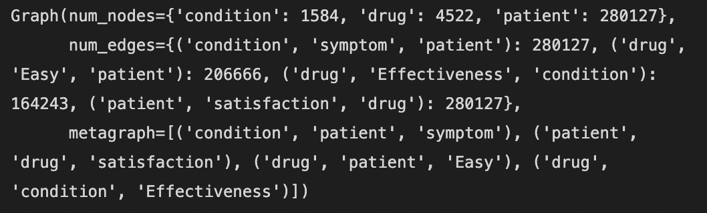
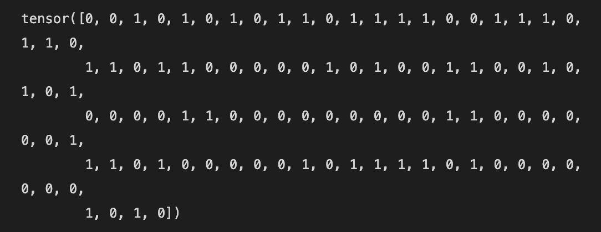

### Kaggle drug recommandation Using R-GCN (Relational GCN)


- Green : target label
- Red : Node
- Blue : Edge
- white : connection and Features of Nodes

----

- 위 그림과 같이 drug, Patient, condition 의 Features 와 노드 간의 관계를 이용해 만족도 학습
- R-GCN 모델을 이용해 학습하여, 만족도 기반으로하는 추천 모델 학습

- dataset link : `https://www.kaggle.com/datasets/rohanharode07/webmd-drug-reviews-dataset`
- 여기서 본 파일은 CSV format 이지만, 용량을 줄이고자 feather format 으로 변환해 저장하였음

### Preprocessing

```
for i in df_.columns:
    df_ = df_[df_[i]!=' ']
df_.dropna(inplace=True)
df_.reset_index(drop=True, inplace=True)

df_['Effectiveness'] = df_['Effectiveness'].apply(lambda x: 0 if (x<4) else 1)
df_['EaseofUse'] = df_['EaseofUse'].apply(lambda x: 0 if (x<4) else 1)
df_['Satisfaction'] = df_['Satisfaction'].apply(lambda x: 0 if (x<4) else 1)

# get `patient_id` column
df_['patient_id'] = [i for i in range(len(df_))]
```

- `null` value 제거
- `edge relation` 정의
- `patient_id` 부여 (개인별 인덱스)

```
ration : 0 ~ 5
    0~3 : 0  # 관련 없음 또는 불만족
    4~5 : 1  # 관련 있음 또는 만족
```

`df_.head()`


### Create Node feature dictionary


- 특정 `Node feature` 를 부여하기위해 `feature dictionary` 생성
- 약물이 갖는 `side_effect set` 중 가장 비번한 set을 해당 약물의 `main_side_effect_set` 으로 정의 및 `embedding`
- 비슷한 특성을 갖는 `Node` 에게 동일 `Feature` 부여하기 위한 `dictionary` \
-> ex) drug_id 또는 drug_type 이 다르더라도 같은 부작용을 일으키면 같은 feature 로 보고 같은 embedding 을 부여


```
def get_dict(df, column : str):
    index = 0
    val_lst = [i for i in df[column].value_counts().index]
    
    dictionary = {}
    
    for i in val_lst:
        dictionary[i] = index
        index += 1
    return dictionary

# get_druc_dict
drug_dict = get_dict(df_, 'DrugId')

# get_feature_dict_of_patient
patient_feat_dict = get_dict(df_, ['Age', 'Sex'])

# get_feature_dict_of_condition
cond_dict = get_dict(df_, 'Condition')

### Drug Feature

# drug_side_dict
drug_side_dict = {}

### most frequency side effect of each drug (dictionary)
for i in drug_dict.keys():
    most_side = df_[df_['DrugId']==i]['Sides'].value_counts().index[0]
    drug_side_dict[i] = most_side


# side_dict (Cause of sides duplicate, using set)
side_dict = {}
index = 0
side_set = set()
side_set.update(drug_side_dict.values())

# side effect dictionary
for j in side_set:
    side_dict[j] = index
    index += 1


# drug_feat_dict
drug_feat_dict = {}

for i in drug_side_dict.keys():
    drug_feat_dict[drug_dict[i]] = side_dict[drug_side_dict[i]]

```


### Create Heterogeneous Graph
- `Heterogeneous Graph` : **서로 다른 특성**의 `node`와 `edge` 를 갖는 `graph` 라 생각하면 됨.
- 위에서 정의한 node 및 edge 들을 array 로 변환 후 적용
- train_set 과 test_set 분리 \
-> val_set 은 추후에 학습 과정에서 train_set 에 `masking` 방식으로 적용 

```
def get_n_arr(dataframe, dictionary, column):    
    num_lst = [int(dictionary[i]) for i in dataframe[column]]
    
    return np.array(num_lst)

# arr list
"""
patient_arr / drug_arr / cond_arr
"""

patient_arr = np.array(df_['patient_id'])

# mapping using dictionary
drug_arr = get_n_arr(df_, drug_dict, 'DrugId')
cond_arr = get_n_arr(df_, cond_dict, 'Condition')

label_arr = torch.tensor(df_['Satisfaction'])

train_bool = torch.zeros(len(df_), dtype=torch.bool).bernoulli(0.9)
inf_bool = ~train_bool

train_index = df_.iloc[patient_arr[train_bool],:].index


inf_index = df_.iloc[patient_arr[inf_bool],:].index

df_t = df_.iloc[train_index, :]
df_inf = df_.iloc[inf_index, :]

df_t['patient_id'] = [i for i in range(len(df_t))]
df_t = df_t.reset_index(drop=True)


df_inf['patient_id'] = [i for i in range(len(df_inf))]
df_inf = df_inf.reset_index(drop=True)

### train array
patient_arr_t = np.array(df_t['patient_id'])
drug_arr_t = get_n_arr(df_t, drug_dict, 'DrugId')
cond_arr_t = get_n_arr(df_t, cond_dict, 'Condition')

label_arr_t = torch.tensor(list(df_t['Satisfaction']))


### TRAIN data
hetero_graph_t = dgl.heterograph({
    ('patient', 'satisfaction', 'drug'): (patient_arr_t, drug_arr_t),
    ('condition', 'symptom', 'patient'): (cond_arr_t, patient_arr_t),
    ('drug', 'Easy', 'patient'): (drug_arr_t[df_t['EaseofUse']==1], patient_arr_t[df_t['EaseofUse']==1]),
    ('drug', 'Effectiveness', 'condition'): (drug_arr_t[df_t['Effectiveness']==1], cond_arr_t[df_t['Effectiveness']==1])
      })


# embedding features
def get_embed(len_keys, lst, embed_n):

    embedding_table = nn.Embedding(num_embeddings=len_keys, 
                               embedding_dim=embed_n)

    
    embed_feat = embedding_table(torch.LongTensor(lst))

    return embed_feat

### Patient Feature
# get_feature lst
patient_f_lst = [patient_feat_dict[(df_['Age'][i], df_['Sex'][i])] for i in range(len(df_))]

# patient embedding
patient_embed = get_embed(len(patient_feat_dict.keys()), patient_f_lst, 10)    # ( 280127 * 10 ) -> 22 types

patient_embed_t = patient_embed[: hetero_graph_t.num_nodes('patient'), : ]

### Condition Feature
# condition feature lst
cond_f_lst = [i for i in range(len(cond_dict.values()))]

# condition embedding
cond_embed = get_embed(len(cond_dict.values()), cond_f_lst, 10)    # ( 1584 * 10 ) -> 1584 Condition types

cond_embed_t = cond_embed[:hetero_graph_t.num_nodes('condition'), : ]   # ( 1584 * 10 ) -> 1584 training Condition types

### drug Feature
# drug feature lst
drug_f_lst = [i for i in drug_feat_dict.values()]

# drug embedding
drug_embed = get_embed(len(drug_feat_dict.keys()), drug_f_lst, 10)   # ( 4522 * 10 ) -> 4522 drug types and 1557 side effect types

drug_embed_t = drug_embed[: hetero_graph_t.num_nodes('drug'), : ] 


hetero_graph_t.edges['satisfaction'].data['label'] = label_arr_t
hetero_graph_t.nodes['patient'].data['feature'] = patient_embed_t
hetero_graph_t.nodes['drug'].data['feature'] = drug_embed_t
hetero_graph_t.nodes['condition'].data['feature'] = cond_embed_t

```

`hetero_graph_t`


- 이때 Graph 내의 Node 및 edge 갯수는 매 실행마다 다를 수 있음 `bernoulli` 분리 방식을 이용했기에


### Model define
- `dgl` library 의 `RGCN` 이용
- `2번째 edge 까지의 관계`를 고려할 것이므로 `layer 갯수는 2개`
- 이때, output 이 `binary class` 이므로 `model class`의 `__init__` layer 부분을 수정해줌 \
```
def __init__(self, in_features, hidden_features, out_features, rel_names, bi_pred=False):

    if bi_pred==False:
        self.pred = HeteroMLPPredictor(out_features, len(rel_names))
    else:
        self.pred = HeteroMLPPredictor(out_features, 2)
```

- `Model class` 에서 return 직전의 `마지막 layer` 를 수정해줌 \
-> `drug node`, `patient node` 의 관계만 학습할 것이므로 해당 내용만 반환하도록 수정


`최종 수정된 Model src`
```
import dgl.nn as dglnn
import torch.nn as nn
import torch.nn.functional as F

class RGCN(nn.Module):
    def __init__(self, in_feats, hid_feats, out_feats, rel_names):
        super().__init__()

        self.conv1 = dglnn.HeteroGraphConv({
            rel: dglnn.GraphConv(in_feats, hid_feats)
            for rel in rel_names}, aggregate='sum')
        
        self.conv2 = dglnn.HeteroGraphConv({
            rel: dglnn.GraphConv(hid_feats, out_feats)
            for rel in rel_names}, aggregate='sum')


    def forward(self, graph, inputs):
        # inputs are features of nodes
        h = self.conv1(graph, inputs)
        h = {k: F.relu(v) for k, v in h.items()}
        h = self.conv2(graph, h)
        return h

class HeteroMLPPredictor(nn.Module):
    def __init__(self, in_dims, n_classes):
        super().__init__() 
        self.W = nn.Linear(in_dims * 2, n_classes)

    def apply_edges(self, edges):
        x = torch.cat([edges.src['h'], edges.dst['h']], 1)
        y = self.W(x)
        return {'score': y}

    def forward(self, graph, h):
        # h contains the node representations for each edge type computed from
        # the GNN for heterogeneous graphs defined in the node classification
        # section (Section 5.1).
        with graph.local_scope():
            graph.ndata['h'] = h   # assigns 'h' of all node types in one shot
            graph.apply_edges(self.apply_edges)
            return graph.edata['score']

class Model(nn.Module):
    def __init__(self, in_features, hidden_features, out_features, rel_names, bi_pred=False):
        super().__init__()
        self.sage = RGCN(in_features, hidden_features, out_features, rel_names)
        
        if bi_pred==False:
            self.pred = HeteroMLPPredictor(out_features, len(rel_names))
        else:
            self.pred = HeteroMLPPredictor(out_features, 2)
        
    def forward(self, g, x, dec_graph):
        h = self.sage(g, x)
        h_2 = {'drug': h['drug'], 'patient': h['patient']}
        return self.pred(dec_graph, h_2)

```


### Masking task
- 위에서 언급한 것처럼 val_set 은 Masking 을 통해 진행
```
# edge length
num_edges = len(hetero_graph_t.edata['label'][('patient', 'satisfaction', 'drug')])

train_mask = torch.zeros(num_edges, dtype=torch.bool).bernoulli(0.8)
val_mask = ~train_mask
```




### Training
- `epochs` : 300 
- `hidden feature` : 20
- `output` : 코드에서는 `5` 이지만 바이너리 부분에 `1`을 넣었으므로 사실상 `2`

```
dec_graph_t = hetero_graph_t['patient', :, 'drug']

label_arr_t = torch.tensor(list(df_t['Satisfaction']))

model = Model(10, 20, 5, hetero_graph_t.etypes, 1)

patient_feats_t = hetero_graph_t.nodes['patient'].data['feature']
drug_feats_t = hetero_graph_t.nodes['drug'].data['feature']
cond_feats_t = hetero_graph_t.nodes['condition'].data['feature']


node_features_t = {'patient': patient_feats_t, 'drug': drug_feats_t, 'condition': cond_feats_t}

dec_graph_t = hetero_graph_t['patient', :, 'drug']

opt = torch.optim.Adam(model.parameters())

for epoch in range(300):
    logits = model(hetero_graph_t, node_features_t, dec_graph_t)
    loss = F.cross_entropy(logits[train_mask], label_arr_t[train_mask])
    opt.zero_grad()
    loss.backward(retain_graph=True)
    opt.step()

    if epoch % 5 == 0:
        acc_val = torchmetrics.functional.accuracy(logits[val_mask], label_arr_t[val_mask])
        print(f"--------- {epoch} ---------")
        print('val_acc : ', acc_val)
```




### Create Inference Graph 
- `train_set` 과 같은 방법으로 `inf_set_graph` 를 만들어줌
- 기존 train_set 에 데이터를 추가하여 기존 관계에 추가된 셋을 넣어주는게 관계 예측에 효과적이므로 train_graph 에 추가 \
-> 이는 실제 상황에서도 인퍼런스 시, 기존 그래프에 추가된 노드들의 관계 또는 기존 노드와 추가된 노드사이의 관계를 예측할 것이라는 판단으로 인해 진행

```
df_test = df_.iloc[hetero_graph_t.num_nodes('patient'):, :]

### added_inference array
patient_arr_inf = np.array(df_test['patient_id'])
drug_arr_inf = get_n_arr(df_test, drug_dict, 'DrugId')
cond_arr_inf = get_n_arr(df_test, cond_dict, 'Condition')

label_arr_inf = torch.tensor(list(df_test['Satisfaction']))

### add edges
hetero_graph_inf = dgl.add_edges(hetero_graph_t, patient_arr_inf, drug_arr_inf, etype='satisfaction')
hetero_graph_inf = dgl.add_edges(hetero_graph_inf, cond_arr_inf, patient_arr_inf, etype='symptom')
hetero_graph_inf = dgl.add_edges(hetero_graph_inf, drug_arr_inf[df_test['EaseofUse']==1], patient_arr_inf[df_test['EaseofUse']==1], etype='Easy')
hetero_graph_inf = dgl.add_edges(hetero_graph_inf, drug_arr_inf[df_test['Effectiveness']==1], cond_arr_inf[df_test['Effectiveness']==1], etype='Effectiveness')

# feature embedding
patient_embed_inf = patient_embed

cond_embed_inf = cond_embed

drug_embed_inf = drug_embed

## node feature and labeling
label_arr_inf = torch.tensor(list(df_['Satisfaction']))

# inference data
hetero_graph_inf.edges['satisfaction'].data['label'] = label_arr_inf
hetero_graph_inf.nodes['patient'].data['feature'] = patient_embed_inf
hetero_graph_inf.nodes['drug'].data['feature'] = drug_embed_inf
hetero_graph_inf.nodes['condition'].data['feature'] = cond_embed_inf

patient_feats_inf = hetero_graph_inf.nodes['patient'].data['feature']
drug_feats_inf = hetero_graph_inf.nodes['drug'].data['feature']
cond_feats_inf = hetero_graph_inf.nodes['condition'].data['feature']

node_features_inf = {'patient': patient_feats_inf, 'drug': drug_feats_inf, 'condition': cond_feats_inf}

node_features_inf = {'patient': patient_feats_inf, 'drug': drug_feats_inf, 'condition': cond_feats_inf}

dec_graph_inf = hetero_graph_inf['patient', :, 'drug']

```

- `Inference_Graph`



- 기존 train_graph 보다 `node` 갯수와 `egde` 갯수가 늘어남을 알 수 있음

### Inference
- `model.eval()` 로 `inference` 모드로 변환
```
model.eval()

with torch.no_grad():
    test_logit = model(hetero_graph_inf, node_features_inf, dec_graph_inf)
test_logit

start = hetero_graph_t.num_nodes('patient')
torch.argmax(test_logit, dim=1)[start : start+100]

inference_acc =torchmetrics.functional.accuracy(test_logit[start:], label_arr_inf[start:])
print("acc : ", inference_acc.item())

```

- Inference 한 결과 중 상위 100개만 뽑아봄


- 전체 결과의 정확도 측정


---
### feedback
- `model` 학습 과정을 테스트해보고자 `preprocessing` 과정을 단순하게 one-hot encoding 수준으로만 진행해보았음
- `side-effect` 를 키워드 중심으로 나누어서 비슷한 약물끼리 clustering 하거나 비슷한 환자들끼리 clustering 하는 방법으로 전처리도 가능할 것
- 해당 약물에 대한 정보를 좀 더 세분화시켜 feature embedding 할 경우 성능은 더 높아질 수 있을 것이라 예상
- 추가적인 `Hyperparameter` 작업도 필요할 것

