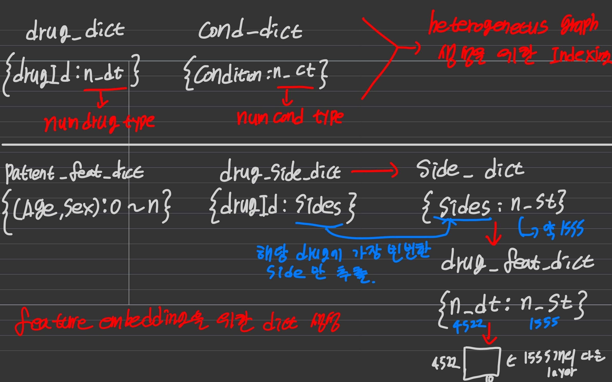
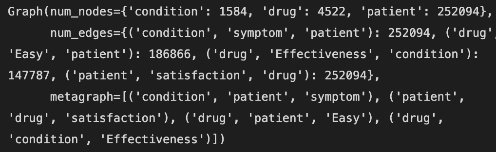

### Kaggle drug recommandation Using R-GCN (Relational GCN)


- Green : target label
- Red : Node
- Blue : Edge
- white : connection and Features of Nodes

----

- 위 그림과 같이 drug, Patient, condition 의 Features 와 노드 간의 관계를 이용해 만족도 학습
- R-GCN 모델을 이용해 학습하여, 만족도 기반으로하는 추천 모델 학습

- dataset link : `https://www.kaggle.com/datasets/rohanharode07/webmd-drug-reviews-dataset`
- 여기서 본 파일은 CSV format 이지만, 용량을 줄이고자 feather format 으로 변환해 저장하였음

### Preprocessing

```
for i in df_.columns:
    df_ = df_[df_[i]!=' ']
df_.dropna(inplace=True)
df_.reset_index(drop=True, inplace=True)

df_['Effectiveness'] = df_['Effectiveness'].apply(lambda x: 0 if (x<4) else 1)
df_['EaseofUse'] = df_['EaseofUse'].apply(lambda x: 0 if (x<4) else 1)
df_['Satisfaction'] = df_['Satisfaction'].apply(lambda x: 0 if (x<4) else 1)

# get `patient_id` column
df_['patient_id'] = [i for i in range(len(df_))]
```

- `null` value 제거
- `edge relation` 정의
- `patient_id` 부여 (개인별 인덱스)

```
ration : 0 ~ 5
    0~3 : 0  # 관련 없음 또는 불만족
    4~5 : 1  # 관련 있음 또는 만족
```

`df_.head()`


### Create Node feature dictionary



- 특정 `Node feature` 를 부여하기위해 `feature dictionary` 생성
- 약물이 갖는 `side_effect set` 중 가장 비번한 set을 해당 약물의 `main_side_effect_set` 으로 정의 및 `embedding`
- 비슷한 특성을 갖는 `Node` 에게 동일 `Feature` 부여하기 위한 `dictionary` \
-> ex) drug_id 또는 drug_type 이 다르더라도 같은 부작용을 일으키면 같은 feature 로 보고 같은 embedding 을 부여


```
def get_dict(df, column : str):
    index = 0
    val_lst = [i for i in df[column].value_counts().index]
    
    dictionary = {}
    
    for i in val_lst:
        dictionary[i] = index
        index += 1
    return dictionary

# get_druc_dict
drug_dict = get_dict(df_, 'DrugId')

# get_feature_dict_of_patient
patient_feat_dict = get_dict(df_, ['Age', 'Sex'])

# get_feature_dict_of_condition
cond_dict = get_dict(df_, 'Condition')

### Drug Feature

# drug_side_dict
drug_side_dict = {}

### most frequency side effect of each drug (dictionary)
for i in drug_dict.keys():
    most_side = df_[df_['DrugId']==i]['Sides'].value_counts().index[0]
    drug_side_dict[i] = most_side


# side_dict (Cause of sides duplicate, using set)
side_dict = {}
index = 0
side_set = set()
side_set.update(drug_side_dict.values())

# side effect dictionary
for j in side_set:
    side_dict[j] = index
    index += 1


# drug_feat_dict
drug_feat_dict = {}

for i in drug_side_dict.keys():
    drug_feat_dict[drug_dict[i]] = side_dict[drug_side_dict[i]]

```


### Create Heterogeneous Graph
- `Heterogeneous Graph` : **서로 다른 특성**의 `node`와 `edge` 를 갖는 `graph` 라 생각하면 됨.
- 위에서 정의한 node 및 edge 들을 array 로 변환 후 적용
- train_set 과 val_set 분리

```
def get_n_arr(dataframe, dictionary, column):    
    num_lst = [int(dictionary[i]) for i in dataframe[column]]
    
    return np.array(num_lst)

# arr list
"""
patient_arr / drug_arr / cond_arr
"""

patient_arr = np.array(df_['patient_id'])

# mapping using dictionary
drug_arr = get_n_arr(df_, drug_dict, 'DrugId')
cond_arr = get_n_arr(df_, cond_dict, 'Condition')

label_arr = torch.tensor(df_['Satisfaction'])

train_bool = torch.zeros(len(df_), dtype=torch.bool).bernoulli(0.9)
inf_bool = ~train_bool

train_index = df_.iloc[patient_arr[train_bool],:].index


inf_index = df_.iloc[patient_arr[inf_bool],:].index

df_t = df_.iloc[train_index, :]
df_inf = df_.iloc[inf_index, :]

df_t['patient_id'] = [i for i in range(len(df_t))]
df_t = df_t.reset_index(drop=True)


df_inf['patient_id'] = [i for i in range(len(df_inf))]
df_inf = df_inf.reset_index(drop=True)

### train array
patient_arr_t = np.array(df_t['patient_id'])
drug_arr_t = get_n_arr(df_t, drug_dict, 'DrugId')
cond_arr_t = get_n_arr(df_t, cond_dict, 'Condition')

label_arr_t = torch.tensor(list(df_t['Satisfaction']))


### TRAIN data
hetero_graph_t = dgl.heterograph({
    ('patient', 'satisfaction', 'drug'): (patient_arr_t, drug_arr_t),
    ('condition', 'symptom', 'patient'): (cond_arr_t, patient_arr_t),
    ('drug', 'Easy', 'patient'): (drug_arr_t[df_t['EaseofUse']==1], patient_arr_t[df_t['EaseofUse']==1]),
    ('drug', 'Effectiveness', 'condition'): (drug_arr_t[df_t['Effectiveness']==1], cond_arr_t[df_t['Effectiveness']==1])
      })


# embedding features
def get_embed(len_keys, lst, embed_n):

    embedding_table = nn.Embedding(num_embeddings=len_keys, 
                               embedding_dim=embed_n)

    
    embed_feat = embedding_table(torch.LongTensor(lst))

    return embed_feat

### Patient Feature
# get_feature lst
patient_f_lst = [patient_feat_dict[(df_['Age'][i], df_['Sex'][i])] for i in range(len(df_))]

# patient embedding
patient_embed = get_embed(len(patient_feat_dict.keys()), patient_f_lst, 10)    # ( 280127 * 10 ) -> 22 types

patient_embed_t = patient_embed[: hetero_graph_t.num_nodes('patient'), : ]

### Condition Feature
# condition feature lst
cond_f_lst = [i for i in range(len(cond_dict.values()))]

# condition embedding
cond_embed = get_embed(len(cond_dict.values()), cond_f_lst, 10)    # ( 1584 * 10 ) -> 1584 Condition types

cond_embed_t = cond_embed[:hetero_graph_t.num_nodes('condition'), : ]   # ( 1584 * 10 ) -> 1584 training Condition types

### drug Feature
# drug feature lst
drug_f_lst = [i for i in drug_feat_dict.values()]

# drug embedding
drug_embed = get_embed(len(drug_feat_dict.keys()), drug_f_lst, 10)   # ( 4522 * 10 ) -> 4522 drug types and 1557 side effect types

drug_embed_t = drug_embed[: hetero_graph_t.num_nodes('drug'), : ] 


hetero_graph_t.edges['satisfaction'].data['label'] = label_arr_t
hetero_graph_t.nodes['patient'].data['feature'] = patient_embed_t
hetero_graph_t.nodes['drug'].data['feature'] = drug_embed_t
hetero_graph_t.nodes['condition'].data['feature'] = cond_embed_t

```

`hetero_graph_t`


